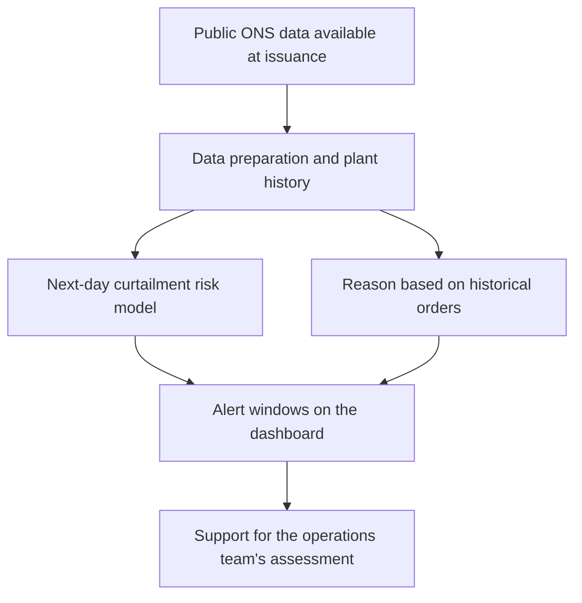

# Zelo · from experimentation to decision support

[← Tiago Luterbach's profile](../README.en.md) · [Português](zelo.md) · English

**Hackathon IA COPPE 2026 · Team project · September 2026**

Zelo is a prototype that provides next-day curtailment risk alerts for wind and solar generation. My contribution combined model experimentation, team coordination, and preparation of the final pitch and slides.

## The problem and the decision

A power plant can have available generation capacity and still receive an instruction to reduce output because of grid conditions. These reductions, known as **curtailment**, make operational planning more difficult.

Our guiding question was: **how can we help an operations team prepare for the next day's curtailment windows?** An alert can support the assessment of when to schedule flexible activities, such as maintenance, within the constraints of actual operations.

## What we built

The final prototype combines a daily forecasting routine with a Streamlit dashboard. Forecast issuance was set for **8 p.m. Brasília time**, using the ONS data available at that point. The dashboard presents:

- risk windows at 30-minute intervals for the following day;
- periods without alerts, which also help with planning;
- a likely reason based on each plant's historical curtailment orders;
- historical alert performance to put reliability into context.

The workflow supports human decisions. The final version does not claim to predict curtailed volume or calculate realized financial savings.

**Project technologies:** Python, Polars, DuckDB, Parquet, scikit-learn, and Streamlit. The temporal neural network experiment used PyTorch.

## My contribution

### Exploring a modeling alternative

Volume forecasting showed limitations during development. I investigated a **GRU temporal neural network**, comparing it with historical references and tabular models to assess whether sequential data could improve results.

The experiment accounted for when information became available and evaluated performance across different months. The documented conclusion was that the GRU **did not provide consistent gains that justified replacing the evaluated approach**. It remained an experiment and was not adopted in the final product model.

This work reinforced a lesson: model selection requires attention to the quality of the comparison, the stability of the results, and the problem the model needs to solve.

### Coordinating the team's work

I helped clarify responsibilities and align progress across workstreams. The aim was to reduce overlapping work and help each team member understand their role and the dependencies within the shared delivery.

### Developing the final presentation

I structured the pitch and prepared the slides, connecting the operational problem, Zelo's proposed solution, the demonstration, and the available evidence. The narrative distinguished measured results, retrospective scenarios, and potential future applications.

## How the team evaluated the alerts

The occurrence model uses a separate classifier for each generation source. Evaluation respects chronological order and includes only information available at forecast issuance. Simple historical models provided comparison baselines.

The team's report records the following results for **September 1–24, 2026**, evaluated per **plant × 30-minute interval**:

| Source | Alert precision | Event recall |
|---|---:|---:|
| Wind | 82% | 94% |
| Solar | 81% | 90% |

**Precision** is the proportion of alerts that corresponded to curtailment. **Recall** is the proportion of intervals with curtailment that were flagged. These metrics belong to the team's occurrence model, not to my GRU experiment.

The results are historical and cover 24 days. They do not establish guaranteed future performance, commercial validation, or recovered energy.

## Limitations and next steps

- Performance may change with curtailment patterns, data availability, and the evaluation period.
- The displayed reason is based on a historical rule, not a verified causal explanation.
- A period without an alert does not guarantee that curtailment will not occur.
- Maintenance scenarios explored during development do not represent savings measured in actual operations.
- The team's proposed next step is a pilot with a generation company to assess the usefulness of alerts in operational workflows.

For me, the Hackathon strengthened my interest in studying data science with attention both to model evaluation and to the decisions people need to make from the results.

## About this record

This case study summarizes the team's September 2026 delivery and reports. Metrics were transcribed from the documented evaluation; no new model was trained for this publication. The product implementation remains in a **private repository**. This page is a public account of my work on the project.

[Back to profile](../README.en.md) · [Discuss the project on LinkedIn](https://www.linkedin.com/in/tiagoluterbachmedeiros/)
