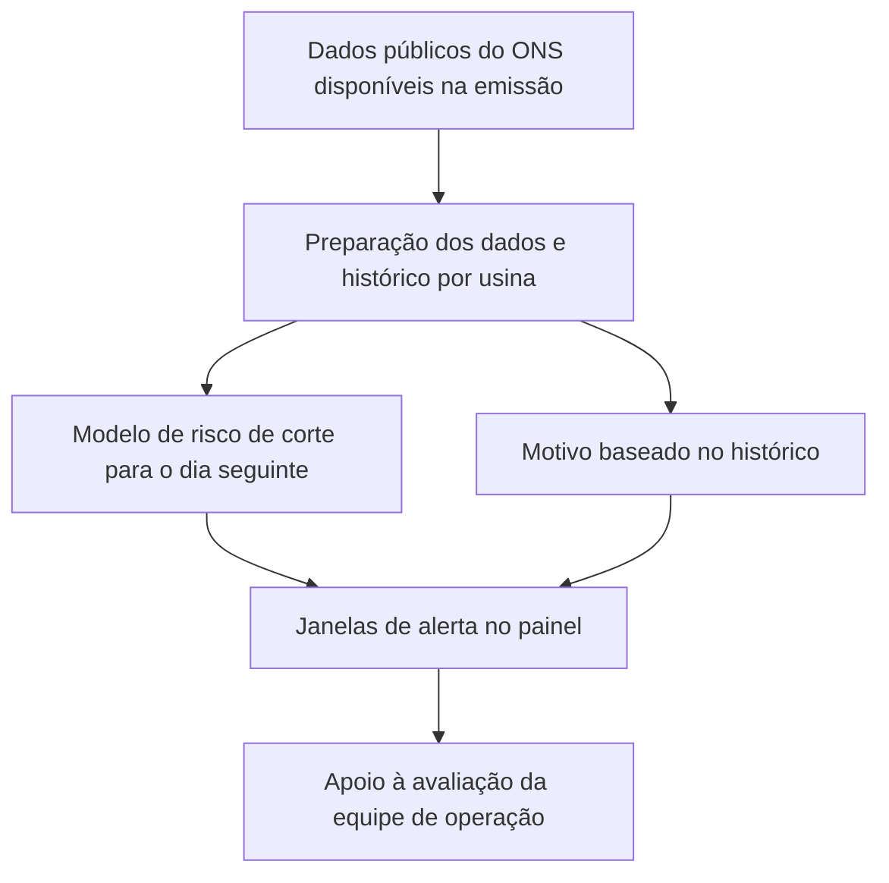

# Zelo · da experimentação ao apoio à decisão

[← Perfil de Tiago Luterbach](../README.md) · Português · [English](zelo.en.md)

**Hackathon IA COPPE 2026 · Projeto em equipe · Setembro de 2026**

O Zelo é um protótipo de avisos de risco de cortes de geração eólica e solar para o dia seguinte. Minha participação combinou investigação de modelos, organização do trabalho da equipe e preparação do pitch e dos slides finais.

## O problema e a decisão

Uma usina pode ter capacidade de gerar energia e receber uma ordem para reduzir sua produção por condições do sistema elétrico. Esses cortes, conhecidos como **curtailment**, tornam o planejamento mais difícil.

A pergunta que orientou o produto foi: **como ajudar uma equipe de operação a se preparar para as janelas de corte do dia seguinte?** O aviso pode apoiar a avaliação de horários para atividades flexíveis, como uma manutenção, respeitando as restrições reais da operação.

## O que construímos

A entrega final reúne uma rotina de previsão diária e um painel em Streamlit. A emissão foi definida para as **20h, no horário de Brasília**, usando os dados do ONS disponíveis até aquele instante. O painel apresenta:

- janelas de risco em intervalos de 30 minutos para o dia seguinte;
- períodos sem alerta, que também ajudam a organizar o planejamento;
- motivo provável baseado no histórico de ordens da usina;
- desempenho histórico dos avisos, para contextualizar sua confiabilidade.

O fluxo apoia decisões humanas. A versão final não promete prever o volume cortado nem calcular economia financeira realizada.

**Tecnologias do projeto:** Python, Polars, DuckDB, Parquet, scikit-learn e Streamlit. No experimento de rede temporal, foi utilizado PyTorch.

## Minha contribuição

### Investigar uma alternativa de modelagem

Durante o desenvolvimento, a previsão de volume apresentava limitações. Investiguei uma **rede temporal GRU**, comparando-a com referências históricas e modelos tabulares para avaliar se sequências de dados poderiam melhorar os resultados.

O experimento considerou a disponibilidade temporal das informações e avaliou o comportamento em diferentes meses. A conclusão registrada foi que a GRU **não trouxe ganho consistente para substituir a abordagem avaliada**. Ela permaneceu como experimento, sem integrar o modelo final do produto.

Esse trabalho reforçou um aprendizado: escolher um modelo exige considerar a qualidade da comparação, a estabilidade do resultado e o problema que ele precisa resolver.

### Organizar as frentes da equipe

Ajudei a tornar explícitas as responsabilidades e a alinhar o andamento das frentes. O objetivo era reduzir sobreposição de tarefas e permitir que cada integrante entendesse sua parte e as dependências da entrega coletiva.

### Construir a apresentação final

Estruturei o pitch e preparei os slides, conectando o problema operacional, a proposta do Zelo, a demonstração e as evidências disponíveis. A narrativa distinguiu resultados medidos, cenários retrospectivos e possibilidades de aplicação futura.

## Como a equipe avaliou os alertas

O modelo de ocorrência usa um classificador por fonte de geração. A avaliação respeita a ordem temporal e considera somente informações disponíveis no instante da emissão. Modelos simples baseados no histórico serviram como referências de comparação.

O relatório da equipe registra os seguintes resultados para **1 a 24 de setembro de 2026**, com unidade de avaliação **usina × intervalo de 30 minutos**:

| Fonte | Precisão dos alertas | Recall dos eventos |
|---|---:|---:|
| Eólica | 82% | 94% |
| Solar | 81% | 90% |

**Precisão** indica a proporção de alertas que corresponderam a cortes. **Recall** indica a proporção de intervalos com corte que foram sinalizados. São métricas do modelo de ocorrência da equipe, não do meu experimento com GRU.

Esses resultados são históricos, de um recorte de 24 dias. Não representam garantia de desempenho futuro, validação comercial ou energia recuperada.

## Limites e próximos passos

- O desempenho pode mudar com o regime de cortes, com os dados disponíveis e com o período avaliado.
- O motivo exibido vem de uma regra histórica; não é uma identificação causal comprovada.
- Um período sem alerta não garante ausência de corte.
- Cenários de manutenção analisados durante o projeto não equivalem a economia medida numa operação real.
- O próximo passo proposto pela equipe é um piloto com uma geradora para avaliar a utilidade dos avisos na rotina operacional.

Para mim, a Hackathon reforçou o interesse em estudar ciência de dados com atenção tanto à avaliação dos modelos quanto à decisão que uma pessoa precisa tomar com o resultado.

## Sobre este registro

Este estudo de caso resume a entrega e os relatórios da equipe de setembro de 2026. As métricas foram transcritas da avaliação documentada, sem um novo treinamento para esta publicação. A implementação do produto permanece em **repositório privado**; esta página é a apresentação pública do meu trabalho no projeto.

[Voltar ao perfil](../README.md) · [Conversar sobre o projeto no LinkedIn](https://www.linkedin.com/in/tiagoluterbachmedeiros/)
